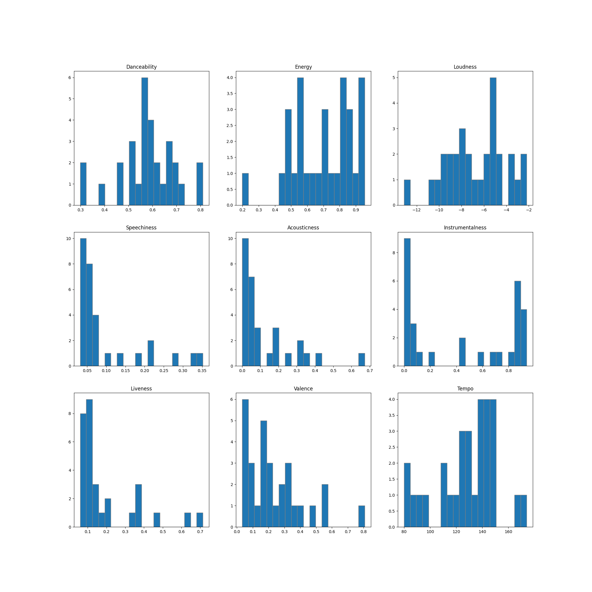

# Spotify User Data

Welcome to Spotify User Data! This is a simple repo to generate figures of **one Spotify user's listening history**. This project uses Spotipy, Matplotlib, and Pandas.  

Example Output:


You will need to set up a Spotify app in the [Spotify Developer Portal](https://developer.spotify.com/dashboard/). When setting up the app, set the **Redirect URI** to `http://localhost:8080`. After creating the app, copy the **Client ID** and **Client Secret** to use in the `.env` file in this repo. 

## Prerequisites
Have Python3 and Pip3 installed on your machine. 

⚠️ These instructions are for Mac/Linux systems. ⚠️

## Install 
Run the following commands 
```
chmod +x ./scripts/install
./scripts/install.sh
```

## Setup

Fill in the `.env` file with your **Client ID** and **Client Secret**.

If you wish, modify the `NUMBER_OF_SONGS`, `TIME_RANGE`, `FIG_OUTPUT_PATH` to fit your preferences. 

## Run 
```
chmod +x ./scripts/install
./scripts/run.sh
```

For subsequent runs after the first run:
```
./scripts/run.sh
```